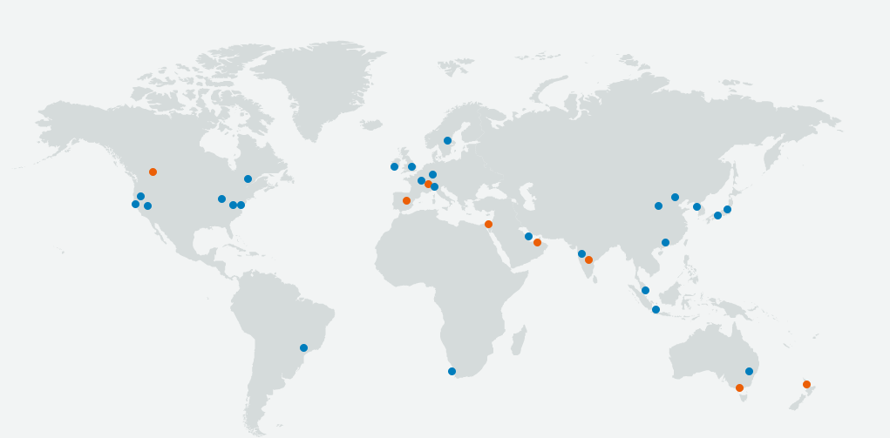

# 105SRE_Cloud_Computing_AWS #

## Added Readme ##
### SRE ###
#### Journey ####

- This is a bullet point

- use nano to use CLI text editor
---

### Intro to AWS And Cloud Computing: ##

- Amazon Web Services (AWS)

- why do we need cloud?
    Pay as you go: when not using it we dont pay for it. 
pay for what we use on the cloud. (cost effective).

- Go global in minutes, if you were to do it locally would take a lot of money to deploy.
therer are a lot of costs involded, whereas if you use a cloud service provider they are
in charge of all of that.
    
On the cloud no need to worry about the security of the data center.

- (on print is a local way to do the data centering)

- **Hybrid:** how is it implemented? Where a business wants to keep some services on print
and some services on cloud.

  - Banks:
    - to open a bank account you need to provide a lot of confidential details.
    some of the info they might wanna have it available to the public, but they would keep
    the confidential details on the on **prem** site, (PINS Passwords etc.) and leave the 
    rest of the public information available to the public.
- On prem : (Local)
- Cloud based (using AWS or other services).

## Why are some businessess going cloud ? ##

in 2008 Netflix went down for 3 days, the on prem site caught fire, and lost everything
they then made the decison to migrate to cloud based, using AWS and AGILE.

By 2018 2019 they had 103M active users, (a sub is 9.99), 

According to one of the officials, they said it took them 6 years to migrate everything
from on prem to completely cloud based.

### Benefits of cloud computing: ###

Pillars of cloud computing:
(investigate examples on this, how is it:)
- Ease of use
- flexibility
- robustness
- cost

### Characteristics ###

- ACES Region london, has at least 2 data centers, (availability zones) 
- why do we need multiple availability zones? 

- CDN (content delivery network) They work by getting a request and storing data on the cache. 
it get stored at the nearest available zone from the user.

- and it will display the data (like cookies), and that helps with the speed.

according to the size of the zone, they will have different AWS services. 
(for example a Sainsburys if its the biggest one, they might have more services,
such as Clothing, where not all sainsburys may have that available due to their size).

Why? (to facilitate user journey 24/7 Experiences). 

**GOVcloud:** They wont rent that, because it belongs to only the Government of the world.

How Does AWS Global provide more than 1 availability Zone?

### Diversion of traffic ###

You may divert the traffic to another availabilty zone to where the traffic may be redirected to 
(maybe due to a failure of one of the zones),
you can use autoscaling to dynamically allocate that traffic to a good available region. This allows
the service to be Highly available & Scalable.

Link here: https://aws.amazon.com/about-aws/global-infrastructure/

We need to ensure that the app is available 24/7. 

--- 

## Q Regarding Today ##

1. What is the role of SRE?
  - An SRE is responsible for making sure that a given service is up and running
  - And making sure that the user Experience is satisfactory through and through 

2. Benefits of Cloud Computing
    - Ease of use
    - Flexibility
    - Robustness
    - Cost Effective

3. AWS?

    - Amazon Web Services
    - On demand cloud computing platforms.

4. AWS Global Infrastructure?

    
    - They have 84 availability zones with 26  Total regions

5. Regions VS Availability zones?

- Each region is a separate Geographic area.
- Availability zones may be located within a Region.
  - (data centers) 

6. What are the four pillars of cloud computing?

    - Ease of use
    - Flexibility
    - Robustness
    - Cost Effective

7. What is CDN ?

- CDN: Content Delivery Network
- Stores cache information closer to the user in a given
- availability one, so it speeds up the User experience.

8. On Prem vs Hybrid - On Prem Vs Public Cloud

- On prem means that business may use local data centres to store information, 
  - an example would be a bank storing private information sucha as passwords and other details.
    - this means that the business will be responsible for the safekeeping of that prem data center.
    - costly
    - Many bank entities prefer using a hybrid approach, meaning that they store private info on prem,
    - but will keep public information on the cloud service to reduce costs.
 - Prem vs public cloud:
     - Prem vs public cloud, like descreibed before, it implies the costs of having a service on a local 
     - prem (data center), this is very costly and the company has to risk the information being lost (netflix fire)
     - If cloud is used the provider is responsible for the safekeeping
     - of that data center, and it follows a pay as you go model.
--- 

## AWS Diagram:


### How to connect to remote VM: ###

1. put the SSH key into your .ssh folder (C/users/username/.ssh)
2. In AWS Select EC2
3. Create a new instance (in this case ubuntu v 18.04)
4. add a name
5. add security groups:
    - make sure to restrict access in SSH selecting proper port
    - allow access to vm through HTTP
    - and set ssh as private
6. Launch and connect following the instructions from
AWS

7. **Remember to stop the instance when not using the vm through the AWS website** 
(some steps may need clarification)
---
Cheatsheet: https://www.guru99.com/linux-commands-cheat-sheet.html

### Inside the VM ##

1. Run: `sudo apt-get update -y`
2. run: `sudo apt-get upgrade -y`
3. run: `sudo apt-get install nginx -y`
4. Check that it was installed sucessfully through checking the public IP

How to check status of nginx or anything:

*Note: "sudo" gives you admin priviledges when running a command*

- How to check a given service:

`systemctl status name_service`

- How to start a service:

`sudo systemctl start name_service`

- How to stop a process:

`sudo systemctl stop name_service`

- How to enable service:
 `sudo systemctl enable service_name`

- How to install a package:

    `sudo apt-get install package_name -y`
    
    `sudo apt install package_name -y` *(also works for newer V)*

- How to remove a package:`sudo apt remove package_name -y` 
- How to check all processes: `top`
- Who am I `uname` or `uname -a` 
- Where am I `pwd` 
- Create a directory: `mkdir dir_name`
- How to check dir `ls` or `ls -a`
- How to create a file `touch name_file` or `nano file_name` 
- How to check content of the file without going inside of the file: `cat file_name`

- how to copy a file `copy file.txt form current location to sre folder`

- move a file: `mv /current_location_of_the_file_you_want_to_copy/target_file   /Destination_where_you_want_to_move_that_file_to/`
    or `sudo mv filename ~/filenamenew`
- how to move back `cd -` or `cd ..`
- how to delete folder `sudo rm -rf folder_name` *(Dangerous, doesn't ask if sure to remove)*

### File Permisions: ###

- How to check a file permision `ll`
- Change file permission `chmod required_permision file_name`
- Write `w` read `r` exec `x`
- https://chmod-calculator.com


### Bash Scripting - Automate process with the script ###

- code block
```bash
#!/bin/bash

# run update

sudo apt-get update -y

# run upgrades

sudo apt-get upgrade -y

# install nginx

sudo apt get install nginx -y

# Ensure it's running - start nginx

sudo systemctl start nginx

# Enable ngin


```

- Change the file to exe file `sudo chmod +x provision.sh`
- How to run an exe file `./provision.sh`

---

## tomcat script: ##

```bash 
#!/bin/bash
  # install nginx
  sudo apt install tomcat9 -y
  # ensure it's running - start nginx
  sudo systemctl start tomcat9
  # enable nginx
  sudo systemctl enable tomcat9
  # allow traffic to port 8080
  sudo ufw allow from any to any port 8080 proto tcp
```
Also add 8080 to the Security groups
then add :8080 to the http
Also this was useful:
https://devops4solutions.com/installation-of-tomcat-on-aws-ec2-linux-integration-with-jenkins/

--- 

## Questions and R+D ##


### - What is a VPC ###
-   Virtual Private Cloud
-   A virtual Network dedicated to your account on the service
-   Private instance that is secure and Isolated within a Public Cloud
-   Stores Data
-   Run Code
-   Host Websites
### - What is an Internet Gateway ###
- A horizontally Scaled, Redudntant and highly available VPC component
- Allows Communications between VPC and Interent
- Enables the resources like EC2 Instances to connect to the internet if they have a public IPV4 or 6 Address
- Provide a target in your VPC Route Tables for traffic routing
- Perform Network Address Translation for instances for traffic routing
### - What is Route Tables ###
- A set of rules called routes that determine where network traffic from your subnet or Gateway is directed
- local route for communication within the VPC
### - What is a subnet ###
- a range of IP adresses in your VPC
- Dividing the network into two or more networks
- Public and Private Subnet exist
### - What is NACLS ###
- Network Access Control List
- Optional Security layer
- Acts as a Firewall for controlling traffic in and out of one or more subnets
### - What is a Security Group ###
- A virtual firewall that controls traffic
- Decides what traffic leaves and reaches the resources it is associated with
- EG Ec2 instance where our security group we added 8080 to allow Tomcat to access
### - How did you secure your app on the public cloud ###
- By using security groups and allowing only Heavily used and necessary ports   
- Tomcat: 8080
- We restrict traffic allowing to enter or exit different adresses within our app
### - What are the outbound rules for security group by default and why? ###
- Default is all inbout traffic from resources that are assigned to the same security group
- Allows all outbound IPV4 traffic
- Allows IPV6 traffic if vpc has an associated ipv6 Block
### - What is the command to kill a process in Linux? ###
```bash
Kill processID
SigKill ProcessID / Kill-9 ProcessID
```
Illustration:


---

### Monolith - N-tier - 2-tier & Microservices Architecture ###

#### Monolith ####
- One big service
- Simple but has limitations and complexity
- Heavy apps can slow down the startup tim
- Each update results into redeploying the full stack app
- Challenging to scale up
- Perfect for small services that don't require scaling
- Schools and smaller business that know they wont scale

#### N-tier ####
- An N-tier architecture divides an application into logical layers and physical tiers.
- Layers are a way to separate responsibilities and manage dependencies.
- Each layer has a specific responsibility.
- A higher layer can use services in a lower layer, but not the other way around.


#### 2-tier ####
- A two-tier architecture is a software architecture in which a presentation layer or interface runs on a client, and a data layer or data structure gets stored on a server.
- Separating these two components into different locations represents a two-tier architecture, as opposed to a single-tier architecture.
#### Microservices Architecture ####


for example: Netflix and banks, whos business needs depend on having an available app 24/7. or that know their service will scale up inmensely.

#### Scaling up and scaling out? ####

caling up is increasing the size of the database (pisical)
where scaling out is used to allow more traffic.

---

https://medium.com/@ahshahkhan/devops-culture-and-cicd-3761cfc62450

What is Docker? 

- Its a virtualization platform to containerise your app, it enables to build a container image and use it across the development process.
- Allows you to split non dependent steps and run them in parallel.
- run apps in containers instead of VMs is becoming popular.

CI CD?
- Continous integration and continous delivery and deployment. (Pipeline)
-its the backbone  of the devops Practices and Automation.

CI: 
- Developers merge/commit code to master branch multiple times a day, fully automated build and test process which gives feedback within few minutes.

CD:
-is an extension of continuous integration to make sure that you can release new changes to your customers quickly in a sustainable way. This means that on top of having automated your testing, you also have automated your release process and you can deploy your application at any point of time by clicking on a button.

CI CD:


Best tools to build CICD pipeline?
Jenkins Circleci, teamcitym, bamboo, gitlab

Jenkins:


---
Business and production
SDLC – software development life cycle
It’s the process of end to end product development.
Products need to follow a certain life cycle.
The Stages are:
•    Planning
Just an idea, only in someone’s head
•    Designing
Writing out how the product will look and what it needs.
•    Development
Develop an environment that works for all of us. i.e the linux instance we created
Implementing the design.
•    Testing
Nothing goes to production without testing.
The test must pass in order to go to the next stage.
Beta versions can happen after testing to get feedback from the user.
•    Staging
It’s the holding area before the code gets deployed. The program is packaged and ready, just on hold till the release date. After staging the code is deployed.


Github
-    One person reviewing is always the best.
-    Someone who is more knowledgeable should merge.
-    Git enter will tell you all the commands that can be performed on git
-    If you delete the .git file you need to reconnect to the github remote before pushing the code back to github.

---

<h3> S3 </h3>

- What is it:

- Amazon S3 or Amazon Simple Storage Service is a service offered by Amazon Web Services that provides object storage through a web service interface. Amazon S3 uses the same scalable storage infrastructure that Amazon.com uses to run its global e-commerce network.
- Simple storage service
- used in data backup, Disaster recovery plan (DR)
- S3 Classes

#### AWS CLI ####

1. `aws configure`
2. (input id keys region format)
3. `aws s3 ls` (using aws go to s3 and do this command
4. `aws s3 mb s3://105-sre-aaron` (how to make a folder)

**How to upload to S3:**

5. (make any file)
6. `aws s3 cp test.txt s3://105-sre-aaron` (aws service name-of-file path)

**Download data from s3:**

`aws s3 cp s3://105-sre-aaron/test.txt ~/`

**Delete bucket and text file**
`aws s3 rb s3://105-sre-aaron`
(rememebr to delete whats inside with `rm`)

--- 

# Following this tutorial to setup northwind in a db #

## This Diagram summarizes the end result: ##


Start installing MSSQL server following this tutorial:

https://www.youtube.com/watch?v=bzOljuaYeUk

Changes from the video: 
1. use the EC2 Public ip when connecting through Microsoft Server SQL tools.
command to acces the SQL server: `sqlcmd -S localhost -U SA -P 'password'`

After installing MSSQL Server and being able to access it, 

2. it is required to change the connection strings inside the app:

(change localhost, add ID, and password to the connection strings)
Inside the Json Config:


Inside Program:


Inside the product context:


3. Package the Api to Ubuntu (in VS tterminal) with this command: `dotnet publish -c release -r ubuntu.18.04-x64`
3.1  zip it, paste it into the .ssh folder.

### Deploying the api: ##

1. Launch a new instance for the API (Has to be in the local machine) and then send it to the instance with this:

`scp -i "105.pem" Apizip.zip ubuntu@ec2-x-xxx-xxx-xxx.eu-west-1.compute.amazonaws.com:~/api.zip`

2. SSH into the remote machine 
3. Install unzip `sudo apt install zip`
4. Unzip the api file: `sudo unzip api.zip`
5. Cd Into the ubuntu files, then find the api file and change its permissions to be executable
`sudo chmod 777 ProductsApi` (tabbing helps)
6. Run the new executable with `./ProductsApi`

next testing local connection:

## To test connection ##

 `curl localhost:5000/api/Employees/1`
 You should retrieve information if you change the information correctly:

EG:


If you can retrieve information then continue with port forwarding:

## Port Forwarding ##

1. Install Nginx

Original link: https://docs.microsoft.com/en-us/aspnet/core/host-and-deploy/linux-nginx?view=aspnetcore-6.0

Use `apt-get` to install Nginx. The installer creates a systemd init script that runs Nginx as daemon on system startup. Follow the installation instructions for Ubuntu at Nginx: Official Debian/Ubuntu packages.

 Note

If optional Nginx modules are required, building Nginx from source might be required.

Since Nginx was installed for the first time, explicitly start it by running:

```Bash


sudo service nginx start
```
Verify a browser displays the default landing page for Nginx. The landing page is reachable at http://<server_IP_address>/index.nginx-debian.html.

2. Configure Nginx
To configure Nginx as a reverse proxy to forward HTTP requests to your ASP.NET Core app, modify `/etc/nginx/sites-available/default.` Open it in a text editor, and replace the contents with the following snippet:


```bash
server {
    listen        80;
    server_name   example.com *.example.com;
    location / {
        proxy_pass         http://127.0.0.1:5000;
        proxy_http_version 1.1;
        proxy_set_header   Upgrade $http_upgrade;
        proxy_set_header   Connection keep-alive;
        proxy_set_header   Host $host;
        proxy_cache_bypass $http_upgrade;
        proxy_set_header   X-Forwarded-For $proxy_add_x_forwarded_for;
        proxy_set_header   X-Forwarded-Proto $scheme;
    }
}
```


(if it doesn't work) Then follow this:

https://github.com/mahedee/Articles/blob/master/dot-net-core/HowToHostASP.NETCoreWebAPIwithMSSQLServerOnLinuxWithNginxFromScratch.md

Step 7 & 9.

Then test the connection through the website and it should all run:

## Now that it is working: ##

SSH into the app and run the ./ProductsApi 
Test any ends:


---


# Docker #

Docker is a set of platform as a service products that use OS-level virtualization to deliver software in packages called containers. 

It works by running commands and trying to find local containers in our machine, if it doesn't appear, it will go to the registry (docker hub) to find the container.

Docker was live in 2013, and by 2017 20% of tech companies have containers deployed, and in 2020 50% of organizations have adopted Docker and deployed docker containers.


Virtualisation Vs Docker: 


- Why docker? 

- docker is very user friendly, starts faster and the size required is small compared to having a VM.
if you make a VM it will take away 50% of the power of your machine, where as docker would take the resources on demand only.


- What are volumes? 

Docker volumes are directories and files that exist on the host file system outside of the Docker container. These volumes are used to persist data and share data between Docker containers. Docker supports the mounting of one or more data volumes from the host OS to the Docker container.


## installing Docker ##

Guide: https://docs.docker.com/desktop/windows/install/

Prerequisites:

- Enable CPU virtualisation in your bios
- In windows features turn on Hyper-Visor

Installation instructions:

- Download and install docker hub
- Should get messege asking you to install WLS2 (windows linux subsystem)
- Log-in to docker hub
---
## Docker Commands: ##
Docker commands:

`Docker images:` Will present the images available

`Docker ps`: To check the containers running

`Docker ps -a`: To check every container running including hidden files

`Docker pull`: to pull the image from docker hub

`Docker run` : to run the image live directly from dockerhub

`docker exec -it [container id] bash`: to access the running container

`docker stop`: stops a running container

`docker kill`: kills container by stopping execution. stop gives time to shut down gracefully

`docker commit [container id][username/imagename]`: creates new image of an edited container on local system

`docker rm [container id]`:removes container

`docker history [image name]`: to view history

`docker image rm [image name]`: deletes image

 - Making docker docs available on our localhost 

```bash

docker run -d -p 4000:4000 docs/docker.github.io 

# Logging into a running container

docker exec -it <container-id/name> sh

# Port mapping in our containers with localhost

docker run -d -p localhost-port:container-port

# Copying files to container

docker cp <file to copy> <container_id>:<path/to/file>
#(Easier if you git bash from the path of the file you want to copy)

# Running a container with ghost

docker run -d -p 2368:2368 ghost

# Running nginx on port 80

docker run -d -p 80:80 nginx

# Replacing nginx default page

docker cp index.html <imageID>:/usr/share/nginx/html
```

Docker Cheatsheet: https://dockerlabs.collabnix.com/docker/cheatsheet/

## DockerHub ##

- Make a commit: `docker commit container_id <Docker_id>/<repo_name>:<tag>`

- Push commit to repo: `docker push <Docker_id>/<repo_name>:<tag>`

- Pull the repo: `docker run -d -p 80:80 <Docker_id>/<repo_name>:<latest>`
